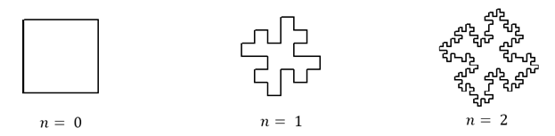
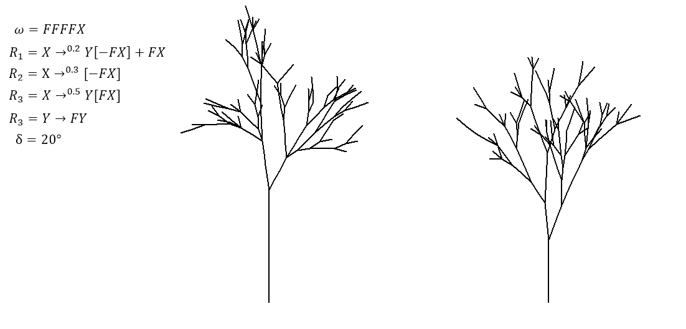
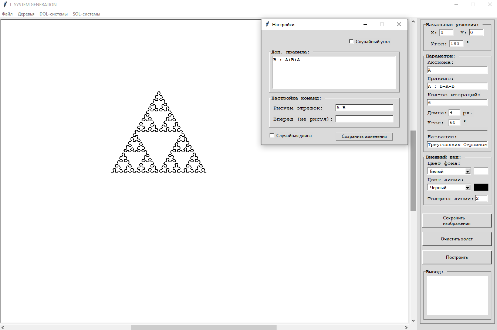
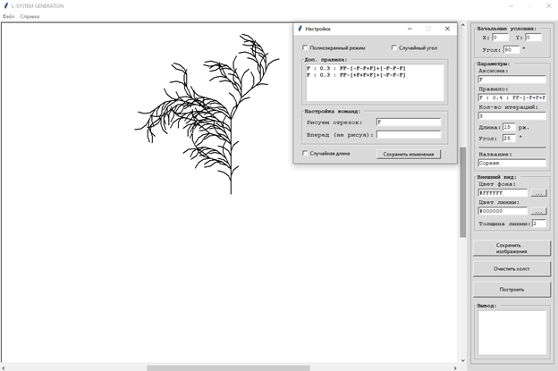

# L-System Implementation with a Graphical User Interface

[](README.md)


## About

This is my educational project. It is a software implementation for building L-systems with a graphical user interface.

The program allows you to visualize [DOL](#dol-systems) and [SOL](#sol-systems) systems with various initial conditions.
It is also possible to save initial conditions and export the results as PNG images.

## Technologies Used

The project is written in **Python 3**. The graphical interface and visualization are built with the standard library; Pillow is the only external dependency.

| Library / module | Purpose |
| ---------------- | ------- |
| [`tkinter`](https://docs.python.org/3/library/tkinter.html) | Graphical interface: main window, menus, input fields, buttons, additional windows |
| [`tkinter.ttk`](https://docs.python.org/3/library/tkinter.ttk.html) | Themed widgets (`Entry`, `Combobox`, `Button`, `Checkbutton`, `Label`) |
| [`turtle`](https://docs.python.org/3/library/turtle.html) | Turtle graphics: rendering L-systems on the canvas (`RawTurtle`, `TurtleScreen`, `ScrolledCanvas`) |
| [`Pillow (PIL)`](https://pypi.org/project/pillow/) | The `ImageGrab` module – capturing the canvas area and saving the result as PNG |
| [`random`](https://docs.python.org/3/library/random.html) | Probability-weighted rule selection in SOL systems (`random.choices`), random angles and lengths (`randint`) |
| [`os`](https://docs.python.org/3/library/os.html) | Working with the `saving` folder and the list of saved systems |
| [`functools`](https://docs.python.org/3/library/functools.html) | `partial` – binding saved files to menu items |

## Installation and Usage

1. Install [Python 3](https://www.python.org/downloads/) (the `tkinter` module is included in the standard distribution).
2. Install Pillow:

   ```bash
   pip install pillow
   ```

3. Clone the repository and run the program:

   ```bash
   git clone https://github.com/DenkiGO/L-system.git
   cd L-system
   python main.py
   ```

# A Bit of Theory

In this part I will only cover the most important concepts related to L-systems that you will need to work with the program.

You can read more about L-systems in the Wikipedia article: [L-system](https://en.wikipedia.org/wiki/L-system).

## DOL Systems

Deterministic context-free L-systems (DOL) make it possible to generate predictable and repeatable sequences of symbols.
They consist of an alphabet, an axiom and a set of rules, where the symbols of the alphabet are unique and the axiom is the initial string.
The system develops cyclically, and for each symbol a matching rule is searched for. If there is no such rule, the symbol remains unchanged.

$$L = (V, \omega, R)$$

Where:

- $V$ (alphabet) – a set of symbols containing both elements that can be replaced (variables) and elements that cannot be replaced (terminal symbols);
- $\omega$ (axiom) – a string of symbols from $V$ defining the initial state of the system;
- $R$ – a set of production rules defining how variables can be replaced by combinations of constants and other variables.

Once an L-system is defined, it begins to develop according to its rules. The initial state of an L-system is its axiom. As the system develops, this string describing the state changes. The development of an L-system is cyclic. In each cycle the string is scanned from beginning to end, symbol by symbol. For each symbol, a rule is searched for in which this symbol is the predecessor. If no such rule is found, the symbol is left unchanged.

### Example of L-system Development

As an example, consider a system with the axiom `A` and the rule `A → ABA`, where `n` is the number of iterations.

```
n=0 A
n=1 ABA
n=2 ABABABA
```

## Geometric Interpretation of L-systems

To obtain plant models using L-systems, individual symbols must be given a geometric meaning, which allows a string of symbols to be mapped to a geometric object.

Traditionally, so-called turtle graphics is used for this - a device (the turtle) that can move forward by a given distance $d$ and turn right and left by a given angle $δ$. The turtle can move either drawing a line or without drawing.

The following symbol interpretation is usually used:

- $F$ – move forward drawing a line of length $d$;
- $f$ – move forward without drawing a line, by distance $d$;
- $+$ – turn left by angle $δ$;
- $-$ – turn right by angle $δ$;
- $[$ – save the current state to the stack. The information stored in the stack
contains the position and orientation of the graphical device;
- $]$ – pop the state from the stack and make it the current state. No line is drawn, although the position changes overall.

### Example of Using the Symbols $F, +, -$

$ω:F+F+F+F$  
$R: F→F+F-F-FF+F+F-F$  
$δ:90$



## SOL Systems

Stochastic L-systems, unlike deterministic L-systems, introduce randomness into the process of generating a sequence of symbols. Instead of unambiguous rules for replacing symbols with other symbols, stochastic L-systems use probabilistic rules, where each rule has its own probability of being applied.

$$L=(V,ω,R,π)$$

Where:

- $π$ — maps the probability of applying a particular rule. The sum of all probabilities must be equal to one.

### Example of a Stochastic L-system in Different Runs



# Program Description

This chapter provides examples of how to use the program.

## Example of Correct DOL System Input

When entering rules, the `:` symbol is used instead of the `→` symbol. All other symbols remain unchanged.



## Example of Correct SOL System Input

After the first `:` symbol, the probability of the rule appearing is entered,
after the second `:` symbol, the rule itself is entered.

