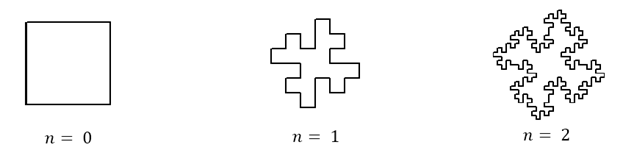
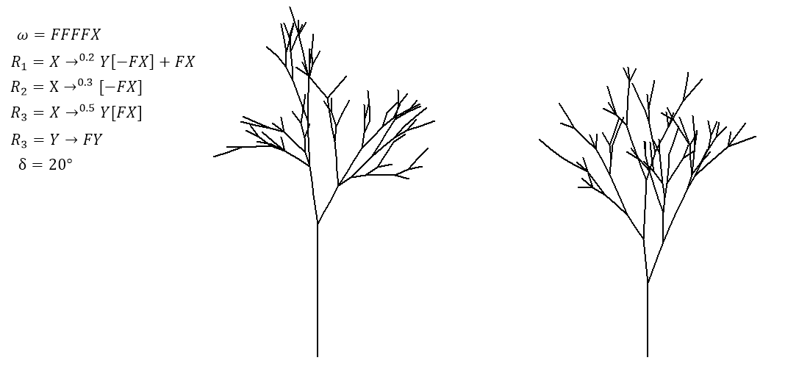

# L-системы

Тут я опишу только самые необходимые понятия о L-ситстемах, необходимых для работы с программой.

Подробнее о L-системах вы можете ознокомиться в статье википедии: [L-системы](https://ru.wikipedia.org/wiki/L-система).

## О программе

Это мой учебный проект. Он является программной реализацией построения L-систем с пользовательским интерфейсом.

Программа позволяет визуализировать [DOL](#dol-системы) и [SOL](#sol-системы) системы с различными начальными условиями.
Также есть возможность сохранять начальные условия и получать их PNG изображения.

## DOL-системы

Контекстно-независимые детерминированные L-системы (DOL) позволяют генерировать предсказуемые и повторяемые последовательности символов.
Они состоят из алфавита, аксиомы и набора правил, где символы алфавита уникальны, а аксиома — начальная строка.
Развитие системы происходит циклически, и для каждого символа ищется правило, которому он соответствует. Если такое правило отсутствует, символ остаётся неизменным.

$$L = (V, \omega, R)$$

Где:
- $$V$$ (алфавит) — множество символов, содержащих как элементы, которые могут быть заменены (переменные), так и элементы, которые не могут быть заменены (терминальные символы);
- $$\omega$$ (аксиома) — строка символов из $$V$$, определяющая начальное состояние системы;
- $$R$$ — множество порождающих правил, определяющих, каким образом переменные могут быть заменены комбинациями констант и других переменных.

Как только L-система определена, она начинает развиваться в соответствии с её правилами. Начальным состоянием L-системы является её аксиома. При дальнейшем развитии эта строка, описывающая состояние, будет меняться. Развитие L-системы происходит циклически. В каждом цикле развития строка просматривается от начала к концу, символ за символом. Для каждого символа ищется правило, для которого этот символ служит предшественником. Если такого правила не нашлось, символ оставляется без изменений.

### Пример развития L-системы

В качестве примера приведена система с аксиомой `A` и правилом `A → ABA`, где `n` — количество итераций.

```
n=0 A
n=1 ABA
n=2 ABABABA
```

## Геометрическая интерпретация L-систем
Для того, чтобы при помощи L-систем получать модели растений, следует приписать отдельным символам некоторый геометрический смысл, позволяющий сопоставлять строке символов геометрический объект.

Традиционно для этого используется так называемая черепашья графика (turtle graphics) - некоторое устройство (черепашка), которое может перемещаться вперед на заданное расстояние $$d$$ и поворачивать вправо и влево на заданный угол $$δ$$. При этом перемещение черепашки может происходить как с рисованием линии, так и без рисования.

Обычно используются следующая интерпретация символов:
- $$F$$ – передвижение вперед с рисованием линии на расстояние d;
- $$f$$ – перемещение вперед без рисования линии на расстояние d;
- $$+$$ – поворот налево на угол δ;
- $$-$$ – поворот направо на заданный угол δ;
- $$[$$ – запись текущего состояния в стек. Информация, хранящаяся в стеке
содержит сведения о положении и ориентации графического устройства;
- $$]$$ – извлечение состояния из стека и преобразование состояния в текущее. Линия не проводится, хотя в целом положение меняется.

### Пример использования символов $$F, +, -$$
$$ω:F+F+F+F$$
$$R: F→F+F-F-FF+F+F-F$$
$$δ:90$$



## SOL-системы
Стохастические L-системы в отличие от, детерминированных L-систем, вводит случайность в процесс генерации последовательности символов. Вместо однозначных правил замены символов на другие символы, стохастические L-системы используют вероятностные правила, где каждое правило имеет свою вероятность применения.

$$L=(V,ω,R,π)$$

Где:
- $$π$$ — отображает вероятность применения определенного правила. Общая сумма всех вероятностей должна быть равна единице. 

### Пример стохастической L-системы при разных запусках

